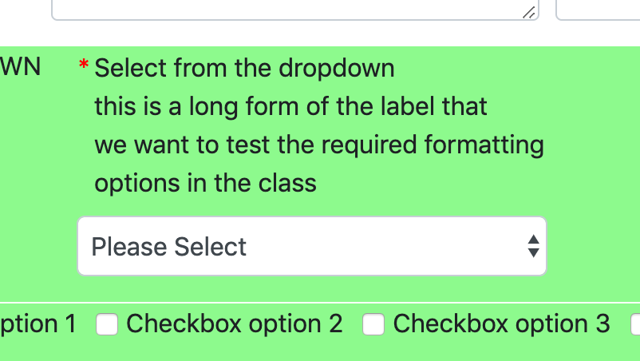
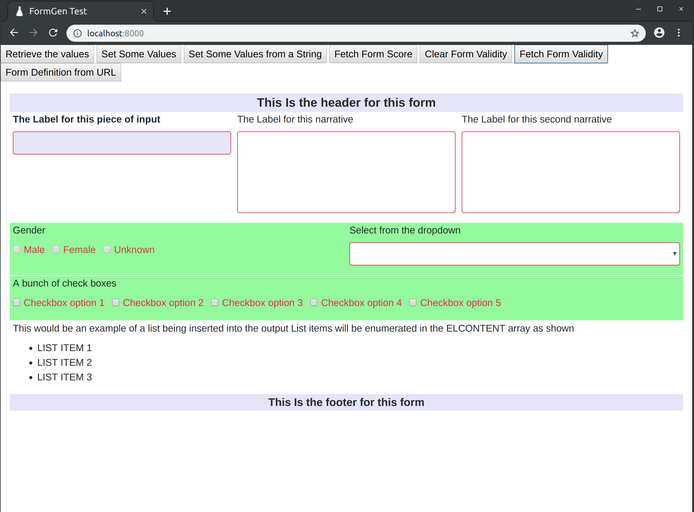
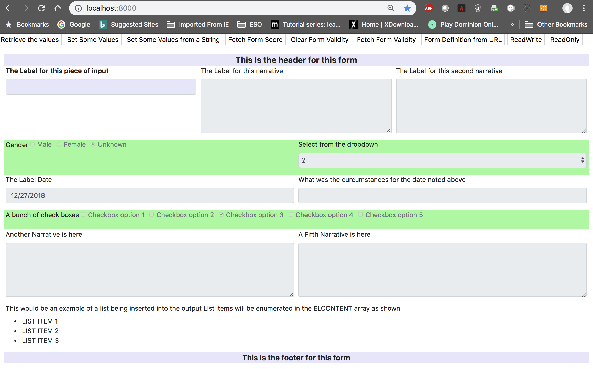
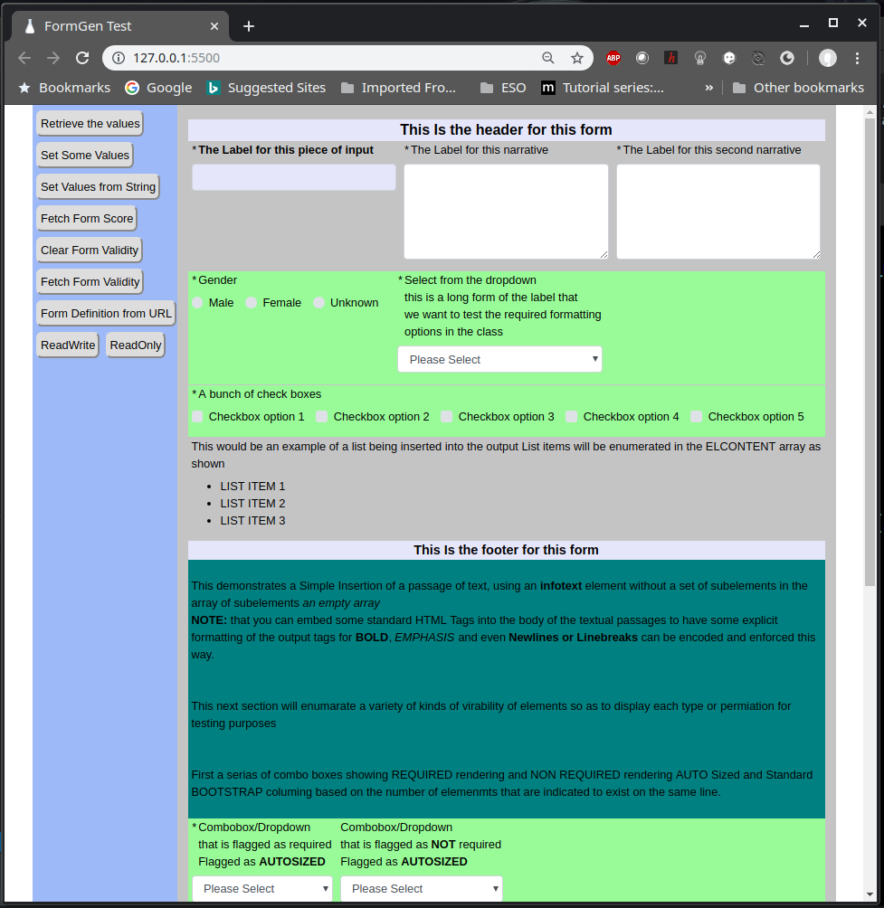
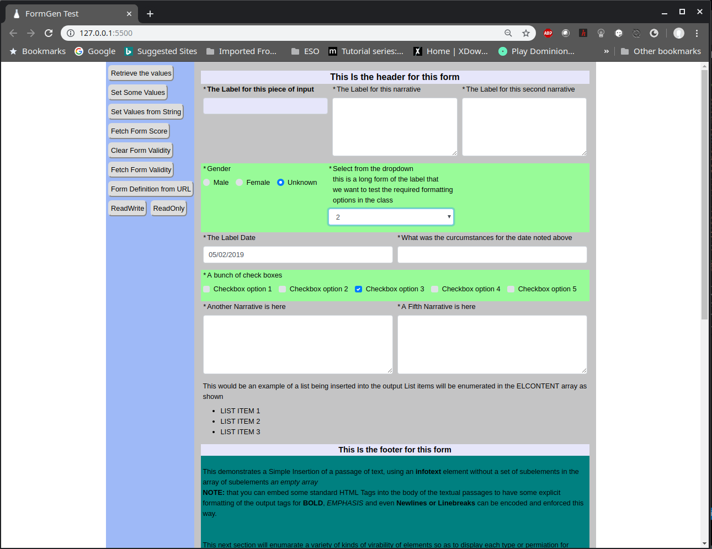

# FormGenBS
Typescript Library to Use Data structures handed to it to interpret and create UI CRUD screens. Tailored for BOOTSTRAP

```typescript
constructor(DomElementID: string, UIElements: UIElement[],VersionString: string,JSobjectName: string) {
        ...
}
```
Parameters:
- **DomElementID**

    This is a container object (Usually a DIV) where you want the Form to be generated. FormGen will hydrate the HTML interface inside of this object automagically...

- **UIElements**

    This simple ARRAY of elements in the form of UIElement. These elements represent the actual objects that FormGen will ge erate inside of the form. UIElement also contains definitions for the various interactions between elements, the scoreing values used in FormGens scoring functions, and Style parameters to apply to the generated objects and their labels...

- **VersionString**

    A simple string that will also be handed back when asking formgen for the set of answers given by the user in the form. Used to support form versioning in whatever persistance model is employed along with FormGen in your projects.

- **JSobjectName**

    A simple string the represents the name of the particular instance of FormGen that your code has created this as. Used when FormGen wires up event handlers for objects its creating so the varous onchange events can call into the specific instance of FormGen. (Formerly used a small stub routine to call in that lived out in the global namespace, Tnis is still a hack but is cleaner than the stub alternative)


Further documentation regarding FormGens Use and the various objects employed are below

## UIElement definition

```typescript
class UIElement {
    public elFormRow: number;
    public elID: string;
    public elType: string;
    public elLabel: string;
    public elContent: string[];
    public elRequired: boolean;
    public elInteractions: UIInteraction[];
    public elInitialVisibility: boolean;
    public elStyle: string;
    public elLabelStyle: string;
    public elFormStyle: string;
    public elScore: number[];
    public elAutoSize: boolean;
    public elCustomClass: string;

    constructor(elformrow: number, elid: string, eltype: string, ellabel: string,
    elcontent: string[], elrequired: boolean,elinteractions: UIInteraction[], elinitialvisibility: boolean, 
    elstyle: string, ellabelstyle: string, elformstyle: string, elscore: number[], 
    elautosize?: boolean, elcustomclass?: string) 
    {
        this.elFormRow = elformrow;
        this.elID = elid;
        this.elContent = elcontent;
        this.elLabel = ellabel;
        this.elRequired = elrequired;
        this.elType = eltype;
        this.elInteractions = elinteractions;
        this.elInitialVisibility = elinitialvisibility;
        this.elStyle = elstyle;
        this.elLabelStyle = ellabelstyle;
        this.elFormStyle = elformstyle;
        this.elScore = elscore;

        if (elautosize == undefined)
        { 
            this.elAutoSize = false;
        }
        else
        {
            this.elAutoSize = elautosize;
        }

        if (elcustomclass == undefined)
        {
            this.elCustomClass = "";
        }
        else
        {
            this.elCustomClass = elcustomclass;
        }

    }
}
```

### Some Details:
- **elFormRow** is s chronological grouping of elements to be inserted at a given row in the bootstrap matrix. FormGen will interpret these entries and group them together and decorate their entries with col-md-x where x is 1 2 3 4 6 12 also, formgen will attempt to evenly space them across the form in the standard bootstrap way. Start at 1 and number each subsequent rows entries chronologically ie. next rows contents would be 2 and then 3 and so on.

- **elid** is a simple string that will be used to identify the element on the DOM. It can be any alpha numeric, it should be unique for each elemet that is being placed into the form.

- **eltype** is a string representation of the kind of ui element desired. Valid types are
    - TEXT
    - NARRATIVE
    - DATE
    - RADIO
    - DROPDOWN
    - CHECKBOX
    - INFOTEXT   This will be a NON Input Simple Label that can also contain Bullet lists of submitems using **elcontent** Array for the list items. The **ellabel** item will carry the main message and each elcontent item will be in the bullet list
    - HEADER     This will be a non Input simple item that will be placed on its own row in the form the **ellabel** paremeter will be used for the label
    - FOOTER     This will be a non Input simple item that will be placed on its own row in the form the **ellabel** paremeter will be used for the label


- **ellabel** is the string label to be applied to the element being placed on the page

- **elcontent**  is an array of strings that get turned into a list of appropriate sub elements for things that have subelements. IE RadioButtons, DropDowns, and CheckBoxes.

- **elrequired** is a boolean used to trigger the required or not check for form validation methods. It will be displayed in a standard required field kind of way as shown in the example below. 

- **elinteractions** is an array of UIInteractions the denote what kind of interactions will be enforced by the formgen class. Primarily used to show and hide other elements based on selected values. See UIInteractions definition below.

- **elinitialvisibility** is a boolean used to indicate if the element will be inserted into the DOM visible or hidden

- **elstyle** is a string that will be inserted as an inline style= assertion on the form-row of the element. Note: that the first element for any given row will have this style value applied to all other elements placed in that row. Useful for things like the whole rows background color for example and is demonstrated in the projects index.html test page. 

- **ellabelstyle** is a string that will be inserted as an inline style= assertion on the Label of the element. 

- **elformstyle** is a string that will be inserted as an inline style= assertion on the combination of element and label container. In BootStrap this is a form-group.

- **elscore** is an array of numbers used to associate a weight numerically with each element as its inserted into the page. Used by the GetFormScore method to return a  value if an associated element is populated or selected. So if you have a radiobutton list or checkboxlist or dropdown list, you will have a weight for each subelement. Text, Dates and Narrative will have a singular value in this array as they are singular value elements onscreen.

- **elautosize** is a optional boolean that flags the resulting input element type (TEXT,TEXTAREA,SELECT,RADIO,CHECKBOX,DATE) wrapping DIV as a class="col-auto" as opposed to decorating it with the calculated col-md-x value (based on how many other elements are also on that row). Useful when you have some fairly narrow input fields that dont need to be spread across a wide browser screen or a tablet in landscape mode. Its optional so it can be left off the UIELEMENT constructor and defaults to **false**.

- **elcustomclass** is an optional string that will be substituted as the class for the specific input element type (TEXT,TEXTAREA,SELECT,RADIO,CHECKBOX,DATE). Useful when you want to substiture some custom rendition on these input elements. Is an optional string and defaults to an empty string whict will then default to rendering the input element with bootstrap standard classes, form-control input-md and  where appropriate custom-check-input and custom-radio-input (CHECKBOX and RADIO)

## UIInteraction definition

```typescript
class UIInteraction
{
    public elIDSource: string;
    public elIDTarget: string;
    public elInteractionType: string;
    public elValueTrigger: string;

    constructor(elidsource: string, elidtarget: string, elinteractiontype: string, elvaluetrigger: string)
    {
        this.elIDSource = elidsource;
        this.elIDTarget = elidtarget;
        this.elInteractionType = elinteractiontype;
        this.elValueTrigger = elvaluetrigger;
    }
}
```
### Some Details:
- **elidsource** this represents the identifier for the element that will trigger the interaction. This is usually the elid of the element this is contained within but does not necessarily need to be. IE you can include a UIInteraction in an element that is not part of the UIInteraction chain.

- **elidtarget** this represents the identifier for the element that interacted with.

- **elinteractiontype** this represented the kind of interaction that will be performed valid types are
    - SHOW  will show based on trigger
    - HIDE  will hide based on trigger
    - REQUIRED will trigger a required status on target based on trigger TODO:
    - NOTREQUIRED will clear a required status on target based on trigger TODO:

- **elvaluetrigger** This represented the associated value that will do the triggering. For a selection list like RADIO BUTTONS, CHECKBOXES, and DROPDOWN LISTS this represented the specific item in those lists that will be doing the triggering. TEXT and NARRATIVES convert entered values to UPPERCASE and perform comparsions against the valuetrigger also converted to uppercase, DATES are anything entered or blank triggers

### METHODS

- **GetFormData()** Returns an array of UIValues. These UIValues will enumerate all of the forms elements and carry their current entries. UIValue definition shown below...

```typescript
    class UIValue
    {
        public uivID: string;
        public uivValue: string;

        constructor(id: string, value: string)
        {
            this.uivID = id;
            this.uivValue = value;
        }
    }
```
Sample JSON data output from a blank form built via the included HTML file, showing version information as well as each UIElement with its entered values...

```json
[{"uivID":"FORMVERSIONSTRING","uivValue":"Version 1"},
{"uivID":"1","uivValue":""},{"uivID":"2","uivValue":""},{"uivID":"2a","uivValue":""},
{"uivID":"3_1","uivValue":"false"},{"uivID":"3_2","uivValue":"false"},
{"uivID":"3_3","uivValue":"false"},{"uivID":"4","uivValue":"Please Select"},
{"uivID":"5","uivValue":""},{"uivID":"5a","uivValue":""},
{"uivID":"6_1","uivValue":"false"},{"uivID":"6_2","uivValue":"false"},
{"uivID":"6_3","uivValue":"false"},{"uivID":"6_4","uivValue":"false"},
{"uivID":"6_5","uivValue":"false"},{"uivID":"7","uivValue":""},{"uivID":"8","uivValue":""}]

```

- **GetFormDefinitionFrom(webUrl: string)** Will attempt to do an HTTPGet from the specified webURL and parse the result as the list of UIElements that create the form. This allows creating the form via webservice calls on the fly, by calling restful endpoints that create the JSON data programatically perhaps from a database of stored forms. The inclided HTML test apparatus simples does an HTTPget from LOCALHOST:8000 (Created using pythons SimpleHTTPServer in my test environment), of a simple JSON file to simulate an endpoint generating the forms definition programatically. That file is shown below...

```json
[
    {"elFormRow":1,"elID":"TheHeader","elContent":[],"elLabel":"This HEADER for this form was taken from the simulated Webservice call","elRequired":true,"elType":"header","elInteractions":[],"elInitialVisibility":true,"elStyle":"font-size:20px;font-weight:bold;background-color: lavender","elLabelStyle":"margin-bottom:0","elFormStyle":"","elScore":[0]},
    {"elFormRow":2,"elID":"1","elContent":[],"elLabel":"The Label for this piece of input Fetched from a HTTPGet","elRequired":true,"elType":"text","elLabelBold":true,"elInteractions":[{"elIDSource":"1","elIDTarget":"8","elInteractionType":"SHOW","elValueTrigger":"N/A"}],"elInitialVisibility":true,"elStyle":"","elLabelStyle":"","elFormStyle":"","elScore":[0]},
    {"elFormRow":2,"elID":"2","elContent":[],"elLabel":"The Label for this narrative Fetched from an HTTPGet","elRequired":true,"elType":"narrative","elLabelBold":true,"elInteractions":[{"elIDSource":"2","elIDTarget":"8","elInteractionType":"SHOW","elValueTrigger":"SAMPLE TRIGGER"}],"elInitialVisibility":true,"elStyle":"","elLabelStyle":"","elFormStyle":"","elScore":[1]},
    {"elFormRow":3,"elID":"3","elContent":["Male","Female","Unknown"],"elLabel":"Gender","elRequired":true,"elType":"radio","elLabelBold":true,"elInteractions":[{"elIDSource":"3","elIDTarget":"5","elInteractionType":"SHOW","elValueTrigger":"Unknown"}],"elInitialVisibility":true,"elStyle":"","elLabelStyle":"","elFormStyle":"","elScore":[2,3,4]},
    {"elFormRow":3,"elID":"4","elContent":["unset","1","2","3","4"],"elLabel":"Select from the dropdown that was fetched from an HTTPGet","elRequired":true,"elType":"dropdown","elLabelBold":true,"elInteractions":[{"elIDSource":"4","elIDTarget":"8","elInteractionType":"HIDE","elValueTrigger":"unset"}],"elInitialVisibility":true,"elStyle":"","elLabelStyle":"","elFormStyle":"","elScore":[0,5,6,7,8]},
    {"elFormRow":4,"elID":"5","elContent":[],"elLabel":"The Label Date","elRequired":true,"elType":"date","elLabelBold":true,"elInteractions":[{"elIDSource":"5","elIDTarget":"5a","elInteractionType":"SHOW","elValueTrigger":""}],"elInitialVisibility":false,"elStyle":"","elLabelStyle":"","elFormStyle":"","elScore":[9]},
    {"elFormRow":4,"elID":"5a","elContent":[],"elLabel":"What was the curcumstances for the date noted above. This should be a long label that should wrap nicely in the space provided as a test. This long Label should not overwite the actual input field","elRequired":true,"elType":"text","elLabelBold":true,"elInteractions":[],"elInitialVisibility":false,"elStyle":"","elLabelStyle":"","elFormStyle":"","elScore":[0]},
    {"elFormRow":5,"elID":"6","elContent":["Checkbox option 1","Checkbox option 2","Checkbox option 3","Checkbox option 4","Checkbox option 5"],"elLabel":"A bunch of check boxes","elRequired":true,"elType":"checkbox","elLabelBold":true,"elInteractions":[{"elIDSource":"6","elIDTarget":"7","elInteractionType":"SHOW","elValueTrigger":"Checkbox option 3"}],"elInitialVisibility":true,"elStyle":"","elLabelStyle":"","elFormStyle":"","elScore":[10,11,12,13,14]},
    {"elFormRow":6,"elID":"7","elContent":[],"elLabel":"Another Narrative is here Fetched from the HTTPGet","elRequired":true,"elType":"narrative","elLabelBold":true,"elInteractions":[],"elInitialVisibility":false,"elStyle":"","elLabelStyle":"","elFormStyle":"","elScore":[15]},
    {"elFormRow":7,"elID":"8","elContent":[],"elLabel":"A Third Narrative is here Fetched from the HTTPGet","elRequired":true,"elType":"narrative","elLabelBold":true,"elInteractions":[],"elInitialVisibility":false,"elStyle":"","elLabelStyle":"","elFormStyle":"","elScore":[16]},
    {"elFormRow":8,"elID":"LIST","elContent":["List Item 1 is here","List Item 2 here","A Third item inserted into the list"],"elLabel":"This is a sample list generated using the new INFOTEXT item","elRequired":false,"elType":"infotext","elLabelBold":true,"elInteractions":[],"elInitialVisibility":true,"elStyle":"","elLabelStyle":"","elFormStyle":"","elScore":[]},
    {"elFormRow":8,"elID":"TheFooter","elContent":[],"elLabel":"This Is the footer for this form  taken from the simulated webservice call","elRequired":true,"elType":"footer","elInteractions":[],"elInitialVisibility":true,"elStyle":"font-size:18px;font-weight:bold;background-color: lavender","elLabelStyle":"margin-bottom:0","elFormStyle":"","elScore":[0]}
]
```

- **GetFormDataAsString()** Essentially returns JSON.Stringify() of the **GetFormData()** method above.

- **SetFormData(UIValues: UIValue[])** Takes an array of UIValues and populates the form. (see **GetFormdata()** above for the definition of the UIValue class )

- **SetFormDataFromString(theString: string)** Does a JSON.Parse() on theString and calls the above Method to populatethe form from a string of values.

- **GetFormScore()** Will return a number of the sum of all the entered fields on the form that have associated weights assigned. Used to apply a simple score to a collection of entered form fields for various business logic assertions.

- **IsFormValid()** Returns a simple TRUE or FALSE if all of the elements that have the **elrequired** flag set in their definition. TEXT, DATES, NARRATIVES are all based on blank/empty or something in them. Checkboxes and RadioButtons and Dropdowns are all if something is selected in them. Validity visuals will be placed onto elements that do NOT pass validity status (Generallally a red outline on the input element itself). Screenshot below for reference



- **ClearFormValidityVisuals()** Will clear the validity queues placed on a form vis the **IsFormValid()** call noted above. 

- **DoFormInteraction(e)** a public internal method that should be wired to a base javascript function outside of the class of the same name that calls the internal method with the same signature.
IE 
If the class is defined as FG then

        function DoFormGenInteraction(e)
        {
            FG.DoFormGenInteraction(e);
        }
 
    be somewhere in the base javascript to wire up the UIInteractions..
 TODO: find a cleaner way to do this
 
- **SetFormVersion(versionstring: string)** Will take versionstring and apply it to the classes internal versioning mechanisim. Echoing this back on **GetFormData** and **GetFormDataAsString**

- **GetFormVersion** Returns the internal version  number either set at constructor or via **SetFormVersion**

- **SetReadWrite(RW: boolean)** True or False handed in maked the form Readonly (FALSE) or ReadWrite (TRUE)

Sample Form Set to READONLY  using FALSE as the Parameter



Same Form set bact to ReadWrite using TRUE as the Parameter



### SAMPLE HTML
(also included in the project)

```html
<!DOCTYPE html>
<html>

<head>
    <!-- Required meta tags -->
    <meta charset="utf-8">
    <meta name="viewport" content="width=device-width, initial-scale=1, shrink-to-fit=no">
    <link rel="stylesheet" href="css/bootstrap.css">

    <title>FormGen Test</title>

    <style>div{
        color: rgb(0, 0, 0);
        font-family: Tahoma, Verdana, Segoe, sans-serif;

    }
    .container{
        width:100vw;
        display:flex;
    }
    .fixed{
        background-color:rgb(158, 185, 247);
        padding: 4px;
        width: 200px;
    }
    .flex-item{
        background-color:rgb(196, 196, 197);
        flex-grow: 1;
    }
    .buttonPadding{
        padding:4px 4px 4px 4px;
        margin:4px 2px 4px 2px;
        border-radius: 8px;
    }

    </style>

</head>
<body>
    <!--  -->

    <div class='container'>

    <div id="testbuttons" class='fixed'>
        <input  type="button" class="buttonPadding"
                onclick="alert(FG.GetFormDataAsString());" 
                id="btnValRetrieve" value="Retrieve the values">

        <input  type="button" class="buttonPadding"
                onclick="FG.SetFormData([ new UIValue('3_3','true'),
                                          new UIValue('5','2018-11-01'),
                                          new UIValue('6_1','true'),
                                          new UIValue('6_3','true'),
                                          new UIValue('7','This is a test')
                                        ]);" 

                id="btnValSet" value="Set Some Values">


        <input  type="button" class="buttonPadding"
                onclick="PopulateFromString();" 
                id="btnValSet1" value="Set Values from String">

        <input  type="button" class="buttonPadding"
                onclick="alert(' The Score is: ' + FG.GetFormScore());" 
                id="btnScoreGet" value="Fetch Form Score">

        <input  type="button" class="buttonPadding"
                onclick=" FG.ClearFormValidityVisuals();" 
                id="btnValidityClear" value="Clear Form Validity">

        <input  type="button" class="buttonPadding"
                onclick="alert(' The Validity is: ' + FG.IsFormValid());" 
                id="btnValidityGet" value="Fetch Form Validity">

        <input  type="button" class="buttonPadding"
                onclick="FG.GetFormDefinitionFrom('http://localhost:5500/SampleForm.json');" 
                id="btnPopulateFromURL" value="Form Definition from URL">

        <input  type="button" class="buttonPadding"
                onclick="FG.SetReadWrite(true);" 
                id="btnSetReadWriteTrue" value="ReadWrite">

        <input  type="button" class="buttonPadding"
                onclick="FG.SetReadWrite(false);" 
                id="btnSetReadWritefalse" value="ReadOnly">
    </div>

    <div id="FormGenBody" class='flex-item' >

    </div>

    </div>


    <script>var exports = {};</script>  <!-- Hack to get rid of Exports Error from TSC compile -->
                                        <!-- This preserves the use of the Typuscript source in -->
                                        <!-- Angular library form for some users of the code library -->

    <script src="js/jquery-3.3.1.min.js"></script>
    <script src="js/popper.js"></script>
    <script src="js/bootstrap.js"></script>

    <script src="FormGenBS.js"></script>

    <script type="text/javascript">
        var ELEs = new Array();

        ELEs.push(
            new UIElement(1,"TheHeader","header","This Is the header for this form",[],true,[],true,
            "font-size:20px;font-weight:bold;background-color: lavender","margin-bottom:0","",[0]));

        ELEs.push(
            new UIElement(2,"1","text","The Label for this piece of input",[],true,
            [new UIInteraction("1","8","SHOW","N/A")],true,"","font-size:16px;font-weight:bold","background-color: lavender",[]));
        ELEs.push(
            new UIElement(2,"2","narrative","The Label for this narrative",[],true,
            [],true,"","","",[1]));

        ELEs.push(
            new UIElement(2,"2a","narrative","The Label for this second narrative",[],true,
            [],true,"","","",[1]));

        ELEs.push(
            new UIElement(3,"3","radio","Gender",["Male","Female","Unknown"],true,
            [new UIInteraction("3","5","SHOW","Unknown")],true,"background-color: palegreen","","",[2,3,4],true,""));
        ELEs.push(
            new UIElement(3,"4","dropdown","Select from the dropdown<br>this is a long form of the label that<br>we want to test the required formatting<br>options in the class",["1","2","3","4"], true,
            [new UIInteraction("4","8","HIDE","4"),new UIInteraction("4","8","HIDE","3"),
             new UIInteraction("4","8","SHOW","1"),new UIInteraction("4","8","SHOW","2")],true,"","","",[5,6,7,8],true,""));
        ELEs.push(
            new UIElement(4,"5","date","The Label Date",[],true,
            [new UIInteraction("5","5a","SHOW","")],false,"","","",[9]));
        ELEs.push(
            new UIElement(4,"5a","text","What was the curcumstances for the date noted above",[],true,
            [],false,"","","",[0]));
        ELEs.push(
            new UIElement(5,"6","checkbox","A bunch of check boxes",
            ["Checkbox option 1","Checkbox option 2","Checkbox option 3","Checkbox option 4","Checkbox option 5"],
            true,[new UIInteraction("6","7","SHOW","Checkbox option 3")],true,"background-color: palegreen","","",[10,11,12,13,14]));
        ELEs.push(
            new UIElement(6,"7","narrative","Another Narrative is here",[],true,[],false,"","","",[15]));

        ELEs.push(
            new UIElement(6,"8","narrative","A Fifth Narrative is here",[],true,[],false,"","","",[16]));

        ELEs.push(
            new UIElement(7,"LIST","infotext","This would be an example of a list being inserted into the output List items will be enumerated in the ELCONTENT array as shown",
            ["LIST ITEM 1","LIST ITEM 2","LIST ITEM 3"],true,[],true,"","","",[]));

        ELEs.push(
            new UIElement(8,"TheFooter","footer","This Is the footer for this form",[],true,[],true,
            "font-size:18px;font-weight:bold;background-color: lavender","margin-bottom:0","",[0]));


        ELEs.push(
            new UIElement(9,"LIST","infotext","<br>This demonstrates a Simple Insertion of a passage of text, using an <b>infotext</b> element without a set of subelements in the array of subelements <em>an empty array</em><br> <b>NOTE:</b> that you can embed some standard HTML Tags into the body of the textual passages to have some explicit formatting of the output tags for <b>BOLD</b>, <em>EMPHASIS</em> and even <b>Newlines or Linebreaks</b> can be encoded and enforced this way.",
            [],true,[],true,"background-color: teal","","",[]));

        ELEs.push(
            new UIElement(10,"LIST","infotext","<br>This next section will enumarate a variety of kinds of virability of elements so as to display each type or permiation for testing purposes",
            [],true,[],true,"background-color: teal","","",[]));

        ELEs.push(
            new UIElement(11,"LIST","infotext","<br>First a serias of combo boxes showing REQUIRED rendering and NON REQUIRED rendering AUTO Sized and Standard BOOTSTRAP columing based on the number of elemenmts that are indicated to exist on the same line.",
            [],true,[],true,"background-color: teal","","",[]));


        ELEs.push(
            new UIElement(12,"10","dropdown","Combobox/Dropdown <br>that is flagged as required<br>Flagged as <b>AUTOSIZED</b>",["1","2","3","4"], true,
            [],true,"background-color: palegreen","","",[],true));

        ELEs.push(
            new UIElement(12,"10a","dropdown","Combobox/Dropdown <br>that is flagged as <b>NOT</b> required<br>Flagged as <b>AUTOSIZED</b>",["1","2","3","4"], false,
            [],true,"background-color: palegreen","","",[],true));

        ELEs.push(
            new UIElement(13,"10","dropdown","Combobox/Dropdown <br>that is flagged as required<br>Flagged as <b>NOT AUTOSIZED</b>",["1","2","3","4"], true,
            [],true,"background-color: palegreen","","",[]));

        ELEs.push(
            new UIElement(13,"10a","dropdown","Combobox/Dropdown <br>that is flagged as <b>NOT</b> required<br>Flagged as <b>NOT AUTOSIZED</b>",["1","2","3","4"], false,
            [],true,"background-color: palegreen","","",[]));


        ELEs.push(
            new UIElement(14,"11","radio","Radio Buttons flagged as required",["Male","Female","Unknown"],true,
            [],true,"","","",[]));

        ELEs.push(
            new UIElement(14,"11a","radio","Radio Buttons flagged as <b>NOT</b> required",["Male","Female","Unknown"],false,
            [],true,"","","",[]));

        ELEs.push(
            new UIElement(15,"12","checkbox","A bunch of check boxes Flagged as required",
            ["Checkbox option 1","Checkbox option 2","Checkbox option 3","Checkbox option 4","Checkbox option 5"],
            true,[],true,"background-color: palegreen","","",[]));

        ELEs.push(
            new UIElement(15,"12a","checkbox","A bunch of check boxes Flagged as <b>NOT</b> required",
            ["Checkbox option 1","Checkbox option 2","Checkbox option 3","Checkbox option 4","Checkbox option 5"],
            false,[],true,"background-color: palegreen","","",[]));

        ELEs.push(
            new UIElement(16,"13","text","A Text entry field flagged as required",[],true,
            [],true,"","","",[]));

        ELEs.push(
            new UIElement(16,"13a","text","A Text entry field flagged as <b>NOT</b> required",[],false,
            [],true,"","","",[]));

        ELEs.push(
            new UIElement(17,"14","narrative","A Narrative field flagged as Required",[],true,
            [],true,"background-color: palegreen","","",[]));

        ELEs.push(
            new UIElement(17,"14a","narrative","A Narrative field flagged as <b>NOT</b> Required",[],false,
            [],true,"background-color: palegreen","","",[]));

        ELEs.push(
            new UIElement(18,"15","date","A Date field flagged as Required",[],true,
            [],true,"","","",[]));

        ELEs.push(
            new UIElement(18,"15","date","A Date field flagged as <b>NOT</b> Required",[],false,
            [],true,"","","",[]));


        var FFG = JSON.stringify(ELEs);

        var FG = new FormGenBS('FormGenBody',ELEs,'Version 1','FG');  

        console.log(FG);

        function PopulateFromString() /// assumes the class is instanced as FG
        {
            var x = '[{"uivID":"1","uivValue":"test data"},{"uivID":"2","uivValue":"sadfsadfsadf"},'+
                 '{"uivID":"3_1","uivValue":"false"},{"uivID":"3_2","uivValue":"false"},' +
                 '{"uivID":"3_3","uivValue":"true"},{"uivID":"4","uivValue":"3"},'+
                 '{"uivID":"5","uivValue":"2018-11-30"},{"uivID":"6_1","uivValue":"true"},'+
                 '{"uivID":"6_2","uivValue":"true"},{"uivID":"6_3","uivValue":"true"},'+
                 '{"uivID":"6_4","uivValue":"false"},{"uivID":"6_5","uivValue":"true"},'+
                 '{"uivID":"7","uivValue":"asdfsadfsadf\\nMultiLine\\nMultiLine"},' +
                 '{"uivID":"8","uivValue":"Some More Text Inserted into a Narrative\\nMultiLine\\nMultiLine"}]';


            FG.SetFormDataFromString(x);

        }


    </script>

</body>
</html>
```

Sample form output from the HTML above with the indicated UIInteractions activated (IE Stuff entered or selected in the appropriate input elements).



**Some Other Notes**

I did most of this development on a Linux System, as such I needed a simple webserver to be running on the folder where this project is housed. Most linux distros have a very serviceable webserver setup created in Python. From the terminal with the projects folder current simple issue the following command

```bash
$ python -m SimpleHTTPServer
```

The default port should be 8000 which is why the sample HTML references localhost:8000 one on of the button click handlers

of you have Python3 installed on your windows machine the simple http server can be launced via the command prompt or powershell prompt using

```bash
python -m http.server
```

Additionally is you are using Visual Studio Code as your editor, (and you could do a lot worse if you are not). You can install the LIVE SERVER addon and it will expose a webserver whos root folder is the base of the current code project on port 5500 by default. A very nice addon that further streamlines development over the older Python Webserver approach. The default INDEX.html page in the project now asumes this approach for the simulated webservice calls making them against localhost:5500 as opposed to localhost:8000.
