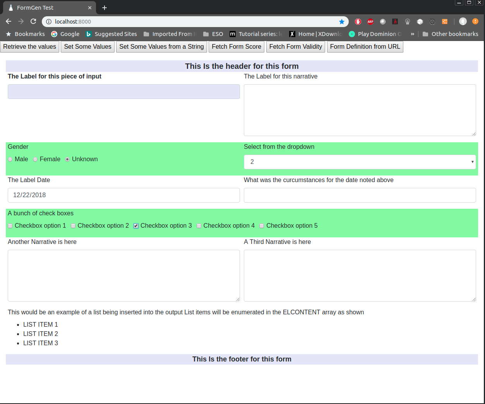

# FormGenBS
Typescript Library to Use Data structures handed to it to interpret and create UI CRUD screens. Tailored for BOOTSTRAP

```typescript
constructor(DomElementID: string, UIElements: UIElement[],VersionString: string) {
        ...
}
```

Takes a simple ARRAY of elements in the form of UIElement and the name of the container object in which to place the results, along with the specific versionstring for the particular forms content.
Versionstring gets handed back and forth between the class and the forms persisted values on saving and loading methods (see below for more details) 

## UIElement definition

```typescript
class UIElement {
    public elFormRow: number;
    public elID: string;
    public elType: string;
    public elLabel: string;
    public elContent: string[];
    public elRequired: boolean;
    public elInteractions: UIInteraction[];
    public elInitialVisibility: boolean;
    public elStyle: string;
    public elLabelStyle: string;
    public elFormStyle: string;
    public elScore: number[];

    constructor(elformrow: number, elid: string, eltype: string, ellabel: string,
        elcontent: string[], elrequired: boolean,elinteractions: UIInteraction[], elinitialvisibility: boolean, 
        elstyle: string, ellabelstyle: string, elformstyle: string, elscore: number[]) {
        this.elFormRow = elformrow;
        this.elID = elid;
        this.elContent = elcontent;
        this.elLabel = ellabel;
        this.elRequired = elrequired;
        this.elType = eltype;
        this.elInteractions = elinteractions;
        this.elInitialVisibility = elinitialvisibility;
        this.elStyle = elstyle;
        this.elLabelStyle = ellabelstyle;
        this.elFormStyle = elformstyle;
        this.elScore = elscore;

    }
}
```

### Some Details:
- **elFormRow** is s chronological grouping of elements to be inserted at a given row in the bootstrap matrix. FormGen will interpret these entries and group them together and decorate their entries with col-md-x where x is 1 2 3 4 6 12 ato attempt to evenly space them across the form in the standard bootstrap way. Start at 1 and number each subsequent rows entries chronologically ie next rows contents would be 2 and then 3 and so on.

- **elid** is a simple string that will be used to identify the element on the DOM. It can be any alpha numeric be unique for each elemet that is being placed into the form.

- **eltype** is a string representation of the kind of ui element desired. Valid types are
    - TEXT
    - NARRATIVE
    - DATE
    - RADIO
    - DROPDOWN
    - CHECKBOX
    - INFOTEXT   This will be a NON Input Simple Label that can also contain Bullet lists of submitems using **elcontent** Array for the list items. The **ellabel** item will carry the main message and each elcontent item will be in the bullet list
    - HEADER     This will be a non Input simple item that will be placed on its own row in the form the **ellabel** paremeter will be used for the label
    - FOOTER     This will be a non Input simple item that will be placed on its own row in the form the **ellabel** paremeter will be used for the label


- **ellabel** is the string label to be applied to the element being placed on the page

- **elcontent**  is an array of strings that get turned into a list of appropriate sub elements for things that have subelements. IE RadioButtons, DropDowns, and CheckBoxes.

- **elrequired** is a boolean used to trigger the required or not check for form validation methods

- **elinteractions** is an array of UIInteractions the denote what kind of interactions will be enforced by the forgen class. Primaryly used to show and hide other elements based on selected values. See UIInteractions definition below.

- **elinitialvisibility** is a boolean used to indicate if the element will be inserted into the DOM visible or hidden

- **elstyle** is a string that will be inserted as an inline style= assertion on the form-row of the element. Note: that the first element for any given row will this style value applied to all other elements place in that row. Useful for things like the whole rows background color for example and is demonstrated in the projects index.html test page. 

- **ellabelstyle** is a string that will be inserted as an inline style= assertion on the Label of the element. 

- **elformstyle** is a string that will be inserted as an inline style= assertion on the combination of element and label container. In BootStrap this is a form-group.

- **elscore** is an array of numbers used to associate a weight numerically with each element as its inserted into the page. Used by the GetFormScore method to return a  value if an associated element is populated or selected. So if you have a radiobutton list or checkboxlist or dropdown list, you will have a weight for subelement. Text, Dates and Narrative will have a singular value in this array.

## UIInteraction definition

```typescript
class UIInteraction
{
    public elIDSource: string;
    public elIDTarget: string;
    public elInteractionType: string;
    public elValueTrigger: string;

    constructor(elidsource: string, elidtarget: string, elinteractiontype: string, elvaluetrigger: string)
    {
        this.elIDSource = elidsource;
        this.elIDTarget = elidtarget;
        this.elInteractionType = elinteractiontype;
        this.elValueTrigger = elvaluetrigger;
    }
}
```
### Some Details:
- **elidsource** this represents the identifier for the element that will trigger the interaction. This is usually the elid of the element this is contained within but does not necessarily need to be. IE you can include a UIInteraction in an element that is not part of the UIInteraction chain.

- **elidtarget** this represents the identifier for the element that interacted with.

- **elinteractiontype** this represented the kind of interaction that will be performed valid types are
    - SHOW  will show based on trigger
    - HIDE  will hide based on trigger
    - REQUIRED will trigger a required status on target based on trigger TODO:
    - NOTREQUIRED will clear a required status on target based on trigger TODO:

- **elvaluetrigger** This represented the associated value that will do the triggering. For a selection list like RADIO BUTTONS, CHECKBOXES, and DROPDOWN LISTS this represented the specific item in those lists that will be doing the triggering. TEXT and NARRATIVES convert entered values to UPPERCASE and perform comparsions against the valuetrigger also converted to uppercase, DATES are anything entered or blank triggers

### METHODS

- **GetFormData()** Returns an array of UIValues. These UIValues will enumerate all of the forms elements and carry their current entries. UIValue definition shown below...

```typescript
    class UIValue
    {
        public uivID: string;
        public uivValue: string;

        constructor(id: string, value: string)
        {
            this.uivID = id;
            this.uivValue = value;
        }
    }
```
Sample JSON data output from a blank form built via the included HTML file, showing version information as well as each UIElement with its entered values...

```json
[{"uivID":"FORMVERSIONSTRING","uivValue":"Version 1"},{"uivID":"1","uivValue":""},
{"uivID":"2","uivValue":""},{"uivID":"3_1","uivValue":"false"},{"uivID":"3_2","uivValue":"false"},
{"uivID":"3_3","uivValue":"false"},{"uivID":"4","uivValue":"unset"},{"uivID":"5","uivValue":""},
{"uivID":"5a","uivValue":""},{"uivID":"6_1","uivValue":"false"},{"uivID":"6_2","uivValue":"false"},
{"uivID":"6_3","uivValue":"false"},{"uivID":"6_4","uivValue":"false"},
{"uivID":"6_5","uivValue":"false"},{"uivID":"7","uivValue":""},{"uivID":"8","uivValue":""}]

```

- **GetFormDefinitionFrom(webUrl: string)** Will attempt to do an HTTPGet from the specified webURL and parse the result as the list of UIElements that create the form. This allows creating the form via webservice calls on the fly, by calling restful endpoints that create the JSON data programatically perhaps from a database of stored forms. The inclided HTML test apparatus simples does an HTTPget from LOCALHOST:8000 (Created using pythons SimpleHTTPServer in my test environment), of a simple JSON file to simulate an endpoint generating the forms definition programatically. That file is shown below...

```json
[
    {"elFormRow":1,"elID":"TheHeader","elContent":[],"elLabel":"This HEADER for this form was taken from the simulated Webservice call","elRequired":true,"elType":"header","elInteractions":[],"elInitialVisibility":true,"elStyle":"font-size:20px;font-weight:bold;background-color: lavender","elLabelStyle":"margin-bottom:0","elFormStyle":"","elScore":[0]},
    {"elFormRow":2,"elID":"1","elContent":[],"elLabel":"The Label for this piece of input Fetched from a HTTPGet","elRequired":true,"elType":"text","elLabelBold":true,"elInteractions":[{"elIDSource":"1","elIDTarget":"8","elInteractionType":"SHOW","elValueTrigger":"N/A"}],"elInitialVisibility":true,"elStyle":"","elLabelStyle":"","elFormStyle":"","elScore":[0]},
    {"elFormRow":2,"elID":"2","elContent":[],"elLabel":"The Label for this narrative Fetched from an HTTPGet","elRequired":true,"elType":"narrative","elLabelBold":true,"elInteractions":[{"elIDSource":"2","elIDTarget":"8","elInteractionType":"SHOW","elValueTrigger":"SAMPLE TRIGGER"}],"elInitialVisibility":true,"elStyle":"","elLabelStyle":"","elFormStyle":"","elScore":[1]},
    {"elFormRow":3,"elID":"3","elContent":["Male","Female","Unknown"],"elLabel":"Gender","elRequired":true,"elType":"radio","elLabelBold":true,"elInteractions":[{"elIDSource":"3","elIDTarget":"5","elInteractionType":"SHOW","elValueTrigger":"Unknown"}],"elInitialVisibility":true,"elStyle":"","elLabelStyle":"","elFormStyle":"","elScore":[2,3,4]},
    {"elFormRow":3,"elID":"4","elContent":["unset","1","2","3","4"],"elLabel":"Select from the dropdown that was fetched from an HTTPGet","elRequired":true,"elType":"dropdown","elLabelBold":true,"elInteractions":[{"elIDSource":"4","elIDTarget":"8","elInteractionType":"HIDE","elValueTrigger":"unset"}],"elInitialVisibility":true,"elStyle":"","elLabelStyle":"","elFormStyle":"","elScore":[0,5,6,7,8]},
    {"elFormRow":4,"elID":"5","elContent":[],"elLabel":"The Label Date","elRequired":true,"elType":"date","elLabelBold":true,"elInteractions":[{"elIDSource":"5","elIDTarget":"5a","elInteractionType":"SHOW","elValueTrigger":""}],"elInitialVisibility":false,"elStyle":"","elLabelStyle":"","elFormStyle":"","elScore":[9]},
    {"elFormRow":4,"elID":"5a","elContent":[],"elLabel":"What was the curcumstances for the date noted above. This should be a long label that should wrap nicely in the space provided as a test. This long Label should not overwite the actual input field","elRequired":true,"elType":"text","elLabelBold":true,"elInteractions":[],"elInitialVisibility":false,"elStyle":"","elLabelStyle":"","elFormStyle":"","elScore":[0]},
    {"elFormRow":5,"elID":"6","elContent":["Checkbox option 1","Checkbox option 2","Checkbox option 3","Checkbox option 4","Checkbox option 5"],"elLabel":"A bunch of check boxes","elRequired":true,"elType":"checkbox","elLabelBold":true,"elInteractions":[{"elIDSource":"6","elIDTarget":"7","elInteractionType":"SHOW","elValueTrigger":"Checkbox option 3"}],"elInitialVisibility":true,"elStyle":"","elLabelStyle":"","elFormStyle":"","elScore":[10,11,12,13,14]},
    {"elFormRow":6,"elID":"7","elContent":[],"elLabel":"Another Narrative is here Fetched from the HTTPGet","elRequired":true,"elType":"narrative","elLabelBold":true,"elInteractions":[],"elInitialVisibility":false,"elStyle":"","elLabelStyle":"","elFormStyle":"","elScore":[15]},
    {"elFormRow":7,"elID":"8","elContent":[],"elLabel":"A Third Narrative is here Fetched from the HTTPGet","elRequired":true,"elType":"narrative","elLabelBold":true,"elInteractions":[],"elInitialVisibility":false,"elStyle":"","elLabelStyle":"","elFormStyle":"","elScore":[16]},
    {"elFormRow":8,"elID":"LIST","elContent":["List Item 1 is here","List Item 2 here","A Third item inserted into the list"],"elLabel":"This is a sample list generated using the new INFOTEXT item","elRequired":false,"elType":"infotext","elLabelBold":true,"elInteractions":[],"elInitialVisibility":true,"elStyle":"","elLabelStyle":"","elFormStyle":"","elScore":[]},
    {"elFormRow":8,"elID":"TheFooter","elContent":[],"elLabel":"This Is the footer for this form  taken from the simulated webservice call","elRequired":true,"elType":"footer","elInteractions":[],"elInitialVisibility":true,"elStyle":"font-size:18px;font-weight:bold;background-color: lavender","elLabelStyle":"margin-bottom:0","elFormStyle":"","elScore":[0]}
]
```
        
- **GetFormDataAsString()** Essentially returns JSON.Stringify() of the **GetFormData()** method above.

- **SetFormData(UIValues: UIValue[])** Takes an array of UIValues and populates the form. (see **GetFormdata()** above for the definition of the UIValue class )

- **SetFormDataFromString(theString: string)** Does a JSON.Parse() on theString and calls the above Method to populatethe form from a string of values.

- **GetFormScore()** Will return a number of the sum of all the entered fields on the form that have associated weights assigned. Used to apply a simple score to a collection of entered form fields for various business logic assertions.

- **IsFormValid()** Returns a simple TRUE or FALSE if all of the elements that have the **elrequired** flag set in their definition. TEXT, DATES, NARRATIVES are all based on blank/empty or something in them. Checkboxes and RadioButtons and Dropdowns are all if something is selected in them. Validity visuals will be placed onto elements that do NOT pass validity status (Generallally a red outline on the input element itself). Screenshot below for reference


- **ClearFormValidityVisuals()** Will clear the validity queues placed on a form vis the **IsFormValid()** call noted above. 

- **DoFormInteraction(e)** a public internal method that should be wired to a base javascript function outside of the class of the same name that calls the internal method with the same signature.
IE 
If the class is defined as FG then

        function DoFormGenInteraction(e)
        {
            FG.DoFormGenInteraction(e);
        }
 
    be somewhere in the base javascript to wire up the UIInteractions..
 TODO: find a cleaner way to do this
 
- **SetFormVersion(versionstring: string)** Will take versionstring and apply it to the classes internal versioning mechanisim. Echoing this back on **GetFormData** and **GetFormDataAsString**

- **GetFormVersion** Returns the internal version  number either set at constructor or via **SetFormVersion**


### SAMPLE HTML
(also included in the project)

```html
<!DOCTYPE html>
<html>

<head>
    <!-- Required meta tags -->
    <meta charset="utf-8">
    <meta name="viewport" content="width=device-width, initial-scale=1, shrink-to-fit=no">
    <link rel="stylesheet" href="css/bootstrap.css">

    <title>FormGen Test</title>
   
</head>
<body>
    <!--  -->
    <div id="testbuttons">
        <input type="button" onclick="alert(FG.GetFormDataAsString());" 
                id="btnValRetrieve" value="Retrieve the values">

        <input type="button" 
                onclick="FG.SetFormData([ new UIValue('3_3','true'),
                                          new UIValue('5','2018-11-01'),
                                          new UIValue('6_1','true'),
                                          new UIValue('6_3','true'),
                                          new UIValue('7','This is a test')
                                        ]);" 
                                
                id="btnValSet" value="Set Some Values">


        <input type="button" 
                onclick="PopulateFromString();" 
                id="btnValSet1" value="Set Some Values from a String">

        <input type="button" 
                onclick="alert(' The Score is: ' + FG.GetFormScore());" 
                id="btnScoreGet" value="Fetch Form Score">

        <input type="button" 
                onclick=" FG.ClearFormValidityVisuals();" 
                id="btnValidityClear" value="Clear Form Validity">

        <input type="button" 
                onclick="alert(' The Validity is: ' + FG.IsFormValid());" 
                id="btnValidityGet" value="Fetch Form Validity">

        <input type="button" 
                onclick="FG.GetFormDefinitionFrom('http://localhost:8000/SampleForm.json');" 
                id="btnPopulateFromURL" value="Form Definition from URL">


    </div>

    <div id="FormGenBody" style="height:90vh; width: 100vw" >
        
    </div>

    <script src="js/jquery-3.3.1.min.js"></script>
    <script src="js/popper.js"></script>
    <script src="js/bootstrap.js"></script>
    
    <script src="FormGenBS.js"></script>
    
    <script type="text/javascript">
        var ELEs = new Array();

        ELEs.push(
            new UIElement(1,"TheHeader","header","This Is the header for this form",[],true,[],true,
            "font-size:20px;font-weight:bold;background-color: lavender","margin-bottom:0","",[0]));

        ELEs.push(
            new UIElement(2,"1","text","The Label for this piece of input",[],true,
            [new UIInteraction("1","8","SHOW","N/A")],true,"","font-size:16px;font-weight:bold","background-color: lavender",[]));
        ELEs.push(
            new UIElement(2,"2","narrative","The Label for this narrative",[],true,
            [],true,"","","",[1]));

        ELEs.push(
            new UIElement(2,"2a","narrative","The Label for this second narrative",[],true,
            [],true,"","","",[1]));

        ELEs.push(
            new UIElement(3,"3","radio","Gender",["Male","Female","Unknown"],true,
            [new UIInteraction("3","5","SHOW","Unknown")],true,"background-color: palegreen","","",[2,3,4]));
        ELEs.push(
            new UIElement(3,"4","dropdown","Select from the dropdown",["","1","2","3","4"], true,
            [new UIInteraction("4","8","HIDE","unset")],true,"","","",[0,5,6,7,8]));
        ELEs.push(
            new UIElement(4,"5","date","The Label Date",[],true,
            [new UIInteraction("5","5a","SHOW","")],false,"","","",[9]));
        ELEs.push(
            new UIElement(4,"5a","text","What was the curcumstances for the date noted above",[],true,
            [],false,"","","",[0]));
        ELEs.push(
            new UIElement(5,"6","checkbox","A bunch of check boxes",
            ["Checkbox option 1","Checkbox option 2","Checkbox option 3","Checkbox option 4","Checkbox option 5"],
            true,[new UIInteraction("6","7","SHOW","Checkbox option 3")],true,"background-color: palegreen","","",[10,11,12,13,14]));
        ELEs.push(
            new UIElement(6,"7","narrative","Another Narrative is here",[],true,[],false,"","","",[15]));
        
        ELEs.push(
            new UIElement(6,"8","narrative","A Fifth Narrative is here",[],true,[],false,"","","",[16]));

        ELEs.push(
            new UIElement(7,"LIST","infotext","This would be an example of a list being inserted into the output List items will be enumerated in the ELCONTENT array as shown",
            ["LIST ITEM 1","LIST ITEM 2","LIST ITEM 3"],true,[],true,"","","",[]));

        ELEs.push(
            new UIElement(8,"TheFooter","footer","This Is the footer for this form",[],true,[],true,
            "font-size:18px;font-weight:bold;background-color: lavender","margin-bottom:0","",[0]));
        
        var FFG = JSON.stringify(ELEs);
        
        var FG = new FormGenBS('FormGenBody',ELEs,'Version 1');

        /// This is a stub routine to wire up the UIInteractions
        /// as I dont know how to have the class call into itself via the ONCLICK and ONCHANGE
        /// manufactured handlers in the inserted DOM elements
        /// Need to find a cleaner way to do this
        function DoFormGenInteraction(e)
        {
            FG.DoFormGenInteraction(e);
        }

        function PopulateFromString() /// assumes the class is instanced as FG
        {
            var x = '[{"uivID":"1","uivValue":"test data"},{"uivID":"2","uivValue":"sadfsadfsadf"},'+
                 '{"uivID":"3_1","uivValue":"false"},{"uivID":"3_2","uivValue":"false"},' +
                 '{"uivID":"3_3","uivValue":"true"},{"uivID":"4","uivValue":"3"},'+
                 '{"uivID":"5","uivValue":"2018-11-30"},{"uivID":"6_1","uivValue":"true"},'+
                 '{"uivID":"6_2","uivValue":"true"},{"uivID":"6_3","uivValue":"true"},'+
                 '{"uivID":"6_4","uivValue":"false"},{"uivID":"6_5","uivValue":"true"},'+
                 '{"uivID":"7","uivValue":"asdfsadfsadf\\nMultiLine\\nMultiLine"},' +
                 '{"uivID":"8","uivValue":"Some More Text Inserted into a Narrative\\nMultiLine\\nMultiLine"}]';
                 

            FG.SetFormDataFromString(x);

        }

    
    </script>

</body>
</html>
```

Sample form output from the HTML above with the indicated UIInteractions activated (IE Stuff entered or selected in the appropriate input elements).



**Some Other Notes**

I did most of this development on a Linux System, as such I needed a simple webserver to be running on the folder where this project is housed. Most linux distros have a very serviceable webserver setup created in Python. From the terminal with the projects folder current simple issue the following command

```bash
$ python -m SimpleHTTPServer
```

The default port should be 8000 which is why the sample HTML references localhost:8000 one on of the button click handlers

of you have Python3 installed on your windows machine the simple http server can be launced via the command prompt or powershell prompt using

```bash
python -m http.server
```


